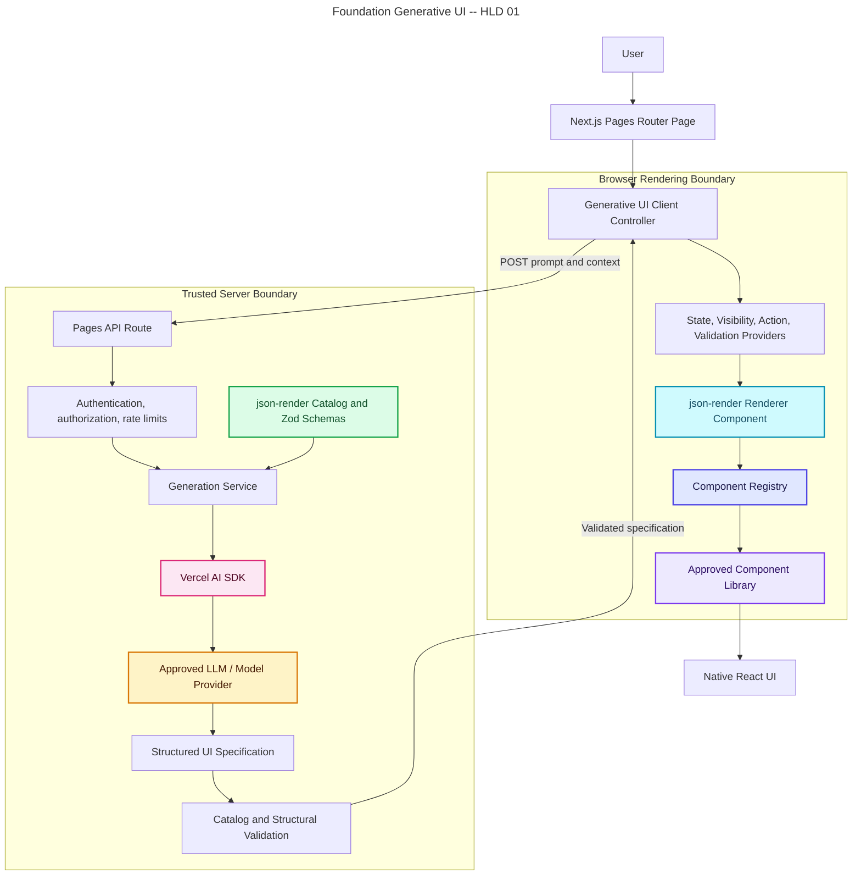

# Foundation Generative UI

## High-Level Design 01

**Status:** Proposed  
**Audience:** Engineers and implementation agents  
**Target:** Existing Next.js application using the Pages Router  
**Reference POC:** `gen-ui-poc`  

## 1. Purpose

Foundation Generative UI allows a user to describe an interface in natural language and receive a native React interface assembled from an approved component library. The language model generates declarative JSON, never React code, HTML, JavaScript, CSS, imports, or arbitrary executable logic.

This document is intentionally independent of the POC file layout. An implementation agent should first inspect the target repository and adapt names, module boundaries, design-system imports, authentication, telemetry, and testing conventions to that codebase.

## 2. Goals

- Generate user interfaces from natural-language requests.
- Restrict generation to an explicitly approved catalog of components, props, slots, events, and actions.
- Render generated specifications as native React components through `json-render`.
- Use the existing application design system and accessibility standards.
- Keep model credentials and model invocation on the server.
- Validate all untrusted input and model output at runtime with Zod.
- Support a Next.js Pages Router application without requiring React Server Components or Server Actions.
- Establish contracts that can later support streaming, persistence, additional models, and App Router migration.

## 3. Non-Goals

- Generating or evaluating arbitrary React, JavaScript, HTML, CSS, or SQL.
- Allowing the model to select unregistered components or call arbitrary application functions.
- Replacing product-specific workflows, authorization, or business validation.
- Treating model output as trusted because structured output was requested.
- Requiring the target application to migrate from Pages Router to App Router.
- Reproducing the POC component styling in production.

## 4. Architecture Decision: Pages Router Transport

The target application uses the Next.js Pages Router. Do not port the POC's `'use server'` action directly.

Use a server-only API Route such as `pages/api/generative-ui/generate.ts` as the generation boundary. Pages Router API Routes are server-side bundles and support standard JSON responses as well as streamed responses. React Server Components and Server Actions are App Router capabilities and must not be assumed in a Pages Router page.

The generation service itself must remain transport-independent. The API Route should validate the request, resolve user context, invoke the service, map errors, and return the result. This keeps a future move to an App Router Route Handler or Server Action small.

### Decision table

| Target environment | Recommended boundary | Initial support |
| --- | --- | --- |
| Next.js Pages Router | `pages/api/...` API Route | Required |
| Hybrid Pages/App Router | API Route initially; Route Handler for App-owned surfaces | Optional |
| Next.js App Router | Route Handler or Server Action | Future |
| Separate backend service | HTTP endpoint calling the same generation service | Future |

## 5. High-Level Architecture



## 6. Core Concepts and Responsibilities

### 6.1 Catalog

The catalog is the model-facing vocabulary and primary generation guardrail. Define it with `defineCatalog`, the React schema from `@json-render/react/schema`, and Zod.

Each catalog component must define:

- A stable component name.
- A strict, JSON-serializable Zod props schema.
- Slot declarations for allowed child composition.
- A concise description explaining when the model should use it.
- An example where it materially improves generation reliability.

Each action must define:

- A stable intent name rather than implementation details.
- A strict Zod parameter schema.
- A description of user-visible behavior.

Catalog rules:

- Prefer small semantic components over generic escape hatches.
- Do not expose `className`, raw style objects, HTML, URLs, event handler source, or component names as unrestricted strings.
- Use enums and bounded values for variants, sizes, alignment, and status.
- Use `.nullable()` for model-generated optional values when required by the installed json-render version and conventions.
- Use bounded arrays and strings to constrain payload size.
- Version breaking catalog changes.

### 6.2 Registry

The registry is the runtime mapping from catalog names to approved React implementations. Define it with `defineRegistry(catalog, ...)`.

Registry adapters must:

- Translate catalog props to the target design-system component API.
- Render slots through the `children` supplied by json-render.
- Emit named events with `emit` or inspect bindings with `on`.
- Use `useBoundProp` for supported two-way state binding.
- Contain presentation adaptation only, not privileged business logic.
- Preserve accessibility semantics, labels, keyboard support, focus behavior, and disabled/loading states.

Actions are implemented by the host application, not by the model. Every action handler must repeat authorization and domain validation before producing side effects.

### 6.3 Generation Service

Create a server-only service with a framework-neutral interface:

```ts
export interface GenerateUiRequest {
  prompt: string;
  context?: Record<string, unknown>;
  catalogVersion: string;
}

export interface GenerateUiResult {
  spec: unknown;
  requestId: string;
  catalogVersion: string;
  model: string;
}

export interface GenerativeUiService {
  generate(request: GenerateUiRequest, actor: AuthenticatedActor): Promise<GenerateUiResult>;
}
```

The service must:

1. Build the system prompt with `catalog.prompt()` and application-specific generation rules.
2. Add only authorized, minimized application context.
3. Invoke the configured model through the AI SDK provider abstraction.
4. Request structured output when supported.
5. Validate the complete output against the json-render spec/catalog schema before returning it.
6. Reject unknown components, malformed references, excessive depth or size, disallowed bindings, and unsupported actions.
7. Record safe operational telemetry.

Do not instantiate providers in client-importable modules. Keep API keys, endpoints, deployment names, and provider clients in server-only files.

### 6.4 Pages API Route

Recommended initial endpoint:

```text
POST /api/generative-ui/generate
Content-Type: application/json
```

Request:

```json
{
  "prompt": "Show a summary of the selected account",
  "context": {},
  "catalogVersion": "1"
}
```

Success response:

```json
{
  "spec": {
    "root": "summary-card",
    "elements": {}
  },
  "requestId": "generated-correlation-id",
  "catalogVersion": "1"
}
```

Error response:

```json
{
  "error": {
    "code": "GENERATION_FAILED",
    "message": "The interface could not be generated.",
    "requestId": "generated-correlation-id"
  }
}
```

Route requirements:

- Accept `POST` only and return `405` otherwise.
- Parse the body with a strict Zod request schema; never trust `NextApiRequest.body` typing.
- Require the application's existing authentication and authorization middleware.
- Apply per-user and tenant rate limits.
- Enforce request body, prompt, context, response, and execution-time limits.
- Return generic client-safe errors while logging structured internal causes.
- Set `Cache-Control: no-store` unless an approved deterministic cache design exists.
- Never return provider errors, prompts, secrets, or stack traces.

### 6.5 Client Controller

The client controller owns transport and user experience, not generation rules. It should:

- Capture the user's prompt.
- Submit a typed request through the application's HTTP client abstraction.
- Support idle, submitting, rendering, success, empty, validation-error, server-error, timeout, and retry states.
- Abort stale requests when the user submits again or navigates away.
- Retain the previous valid UI while a refresh is in progress where appropriate.
- Pass only validated specifications to the renderer.
- Announce loading and error states accessibly.
- Avoid exposing provider configuration or catalog prompt text.

For the first production slice, prefer a one-shot JSON response. It is simpler to operate and test. Add streaming only after measuring latency and validating the hosting platform's buffering and timeout behavior.

### 6.6 Renderer Host

The renderer host wraps `Renderer` with the providers required by the selected json-render features:

```tsx
<StateProvider initialState={initialState}>
  <VisibilityProvider>
    <ActionProvider handlers={actionHandlers}>
      <ValidationProvider customFunctions={validationFunctions}>
        <Renderer spec={spec} registry={registry} loading={isLoading} />
      </ValidationProvider>
    </ActionProvider>
  </VisibilityProvider>
</StateProvider>
```

Only include providers actually used by the installed json-render version, but centralize this composition in one host component. Memoize action-handler creation as recommended by json-render and use current state references when handlers require current state.

## 7. End-to-End Flow

1. The user enters a request in a Pages Router React page.
2. The client validates basic prompt requirements and posts to the generation API Route.
3. The route authenticates the request, validates its body, applies policy and rate limits, and creates a correlation ID.
4. The generation service constructs the catalog prompt and adds application rules plus authorized context.
5. The AI SDK invokes the configured model using server-held credentials.
6. The model returns a declarative json-render specification.
7. The service validates the specification structurally and semantically.
8. The API Route returns the validated specification and non-sensitive metadata.
9. The client stores the specification and passes it to the renderer host.
10. json-render resolves the tree through the registry into approved React components.
11. User events emit declared intents; registered application handlers validate and execute those intents.

## 8. Suggested Target File Layout

Adapt this structure to the target repository's conventions rather than copying it literally:

```text
src/
  features/generative-ui/
    catalog/
      catalog.ts
      catalog-version.ts
      schemas.ts
    registry/
      registry.tsx
      adapters/
    components/
      GenerativeUiComposer.tsx
      GenerativeUiRenderer.tsx
      GenerativeUiError.tsx
    client/
      generative-ui-client.ts
      contracts.ts
    server/
      generate-ui.ts
      model-provider.ts
      prompt-policy.ts
      spec-validation.ts
    actions/
      handlers.ts
    tests/
      fixtures/
pages/
  api/
    generative-ui/
      generate.ts
```

Use existing aliases, feature folders, API wrappers, DI patterns, logging, auth middleware, and test locations in the target repository.

## 9. Specification and Validation

Structured model output is necessary but not sufficient. Apply validation at multiple boundaries.

### Request validation

- Trim the prompt and reject empty input.
- Set an explicit maximum prompt length.
- Define and validate every context field; avoid unrestricted `unknown` context in the concrete implementation.
- Derive sensitive identity and tenancy from the authenticated server session, never from client-provided context.

### Specification validation

- Parse against the canonical json-render schema for the installed package version.
- Ensure `root` references an existing element.
- Ensure every child reference exists.
- Reject cycles if the format requires a tree.
- Reject unknown component and action names.
- Validate each element's props against its catalog component schema.
- Limit element count, child count, nesting depth, string length, and serialized size.
- Restrict external URLs to approved schemes and hosts where URL props exist.
- Reject unsupported binding expressions and prototype-polluting keys.

The catalog and runtime validator must share definitions so they cannot silently drift. Add malformed-spec tests independently of model tests.

## 10. Actions and State

Treat generated actions as declarative requests, not authority.

- Catalog action names should describe intent, for example `open_record`, `apply_filter`, or `submit_review`.
- Never expose generic actions such as `fetch_url`, `run_script`, `execute_query`, or unrestricted `navigate`.
- Validate action parameters with catalog Zod schemas.
- Reauthorize on every server-side effect.
- Require explicit user confirmation for destructive, financial, external, or irreversible operations.
- Keep action handlers in application-owned modules and inject them into the renderer host.
- Record action name, outcome, duration, actor, tenant, and request ID without logging sensitive payloads.

Use json-render state and bindings for local presentation state. Keep authoritative domain state in existing application stores and services.

## 11. AI Prompt and Model Policy

The effective system prompt should contain:

- `catalog.prompt()` output.
- A requirement to return only the expected json-render specification or SpecStream format.
- Product layout and composition rules.
- Accessibility requirements.
- Rules against inventing components, props, actions, data, or unsupported bindings.
- A requirement to represent missing data honestly rather than fabricate values.
- Limits on component count and complexity.

Model configuration must be environment-driven and centrally owned. Pin an approved model/deployment per environment, configure deterministic behavior where possible, and define timeout and retry policy. Do not silently fall back to a different provider or model without telemetry because output quality and schema adherence may change.

## 12. Streaming Design

Streaming is optional for the initial implementation. If adopted, use json-render's SpecStream JSONL patches and compile them with its supported compiler APIs.

For Pages Router:

- Stream from an API Route with appropriate headers and `res.write`/`res.end`, subject to deployment-platform support.
- Use `Content-Type: application/x-ndjson` or the content type expected by the selected client integration.
- Set `Cache-Control: no-store` and disable proxy buffering where infrastructure requires it.
- Compile patches incrementally in the client and render only compiler-produced state.
- Abort provider generation when the browser disconnects where supported.
- Treat a partial stream as transient UI; only persist a fully validated final specification.

Do not use `useUIStream({ api })` blindly. Confirm that its protocol and response expectations match the installed json-render version and the Pages API Route output. A custom hook around `createSpecStreamCompiler` is acceptable when needed.

## 13. Security and Privacy

- Keep model credentials server-side and in the target platform's secret store.
- Apply existing CSRF protections and same-origin controls to mutation endpoints.
- Authenticate before invoking the model to avoid unauthenticated cost exposure.
- Rate-limit by user, tenant, and IP according to application policy.
- Minimize context sent to the model and redact secrets, credentials, tokens, regulated data, and unnecessary personal data.
- Treat user prompts as untrusted input and model output as untrusted data.
- Never render model-provided raw HTML or execute model-provided code.
- Enforce authorization independently of generated visibility conditions.
- Add content-safety controls required by product policy.
- Define retention and deletion rules for prompts, generated specs, and model telemetry.
- Review provider data-processing and regional-residency requirements before production use.

## 14. Reliability and Error Handling

Define stable error categories:

- `INVALID_REQUEST`
- `UNAUTHENTICATED`
- `FORBIDDEN`
- `RATE_LIMITED`
- `GENERATION_TIMEOUT`
- `MODEL_UNAVAILABLE`
- `INVALID_MODEL_OUTPUT`
- `SPEC_TOO_COMPLEX`
- `GENERATION_FAILED`

Use bounded retries only for transient provider failures. Do not retry invalid model output repeatedly without a deliberate repair strategy and a strict attempt limit. Preserve a request ID across browser, API Route, generation service, provider call, logs, and metrics.

The client should display actionable but non-sensitive messages and provide retry/reset controls. A renderer error boundary must prevent one malformed adapter or component from breaking the containing page.

## 15. Observability

Capture:

- Request ID, actor/tenant identifiers in approved hashed or internal form.
- Catalog version, application version, provider, and model deployment.
- Generation duration, time to first byte for streaming, render duration, and action duration.
- Token usage and estimated cost where available.
- Specification byte size, element count, component counts, and validation outcome.
- Error category and retry count.
- User cancellation and regeneration rates.

Do not log full prompts, context, generated props, or provider payloads by default. Any sampled payload logging requires explicit privacy approval and redaction.

## 16. Performance and Limits

Initial limits must be explicit configuration rather than implicit defaults. The implementation team should select values appropriate to the product, including:

- Prompt and context byte limits.
- Maximum generated elements and nesting depth.
- Maximum rows/items per component.
- Model timeout and API Route execution duration.
- Concurrent generations per user and tenant.
- Maximum final specification size.

Lazy-load the generative UI feature and large component adapters where useful. Avoid placing server-only catalog prompt generation or provider code in client bundles. Measure registry/component bundle impact.

## 17. Accessibility and UX

- All registry adapters must meet the target application's WCAG level.
- Prefer the existing accessible component library over custom primitives.
- Preserve visible labels and accessible names.
- Ensure dialogs manage focus and include title/description semantics.
- Announce generation status and errors through appropriate live regions.
- Keep layout stable while generating.
- Provide cancel, retry, reset, and regenerate controls where appropriate.
- Do not allow generated content to bypass localization, formatting, or design tokens.

## 18. Testing Strategy

### Unit tests

- Catalog schemas accept valid props and reject invalid or excessive props.
- Request and response contracts parse correctly.
- Spec validation catches missing roots, unknown elements, cycles, invalid references, excessive complexity, and unregistered actions.
- Registry adapters map props, slots, events, disabled states, and bindings correctly.
- Generation service maps provider failures to stable domain errors.

### Integration tests

- API Route method, auth, validation, rate-limit, timeout, success, and error behavior.
- AI SDK provider is mocked; tests must not call a real model by default.
- A fixture specification renders through the real registry.
- Declared actions reach only their registered handlers with validated parameters.
- Client cancellation and stale-response handling work.

### End-to-end tests

- Submit a prompt and render a deterministic mocked specification.
- Retry after a generation failure.
- Verify keyboard interaction and focus behavior for interactive generated components.
- Verify responsive layouts and no component overflow.
- Verify an unauthorized request cannot generate UI or invoke actions.

### Contract and evaluation tests

- Keep versioned golden specifications for common product prompts.
- Run offline model evaluations for schema adherence, component selection, accessibility, and hallucination rate before model/catalog changes.
- Fail CI on catalog/registry name mismatches.

## 19. Delivery Plan

### Phase 0: Repository discovery

1. Identify Next.js and React versions, Pages Router conventions, TypeScript settings, and deployment runtime.
2. Locate design-system components, auth middleware, API wrappers, observability, rate limiting, state management, and test frameworks.
3. Confirm package versions and read the matching json-render and Next.js documentation.
4. Decide the first product use case and approved data context.

### Phase 1: Vertical slice

1. Install compatible AI SDK, json-render, Zod, and model-provider packages.
2. Create a small catalog from existing components.
3. Implement registry adapters and fixture-driven renderer tests.
4. Implement the server-only generation service.
5. Add the Pages API Route with auth, validation, limits, and safe errors.
6. Add the client controller and renderer host.
7. Ship one-shot generation behind a feature flag.

### Phase 2: Production hardening

1. Add semantic spec validation and complexity budgets.
2. Add action handlers with authorization and confirmations.
3. Add telemetry, cost controls, privacy controls, and model evaluations.
4. Complete accessibility, load, abuse, and failure testing.
5. Add catalog versioning and persistence if required.

### Phase 3: Progressive rendering

1. Validate hosting support for streaming Pages API Routes.
2. Implement SpecStream transport and incremental compilation.
3. Add cancellation, partial-state UX, stream telemetry, and fallback to one-shot generation.

## 20. Implementation-Agent Instructions

An AI agent implementing this design in another repository must:

1. Read repository instructions and inspect existing architectural patterns before editing.
2. Confirm whether the relevant surface is Pages Router, App Router, or hybrid; default to a Pages API Route for Pages-owned UI.
3. Reuse existing design-system components and server infrastructure rather than copying POC components.
4. Verify APIs against the exact installed versions of Next.js, json-render, AI SDK, React, and Zod.
5. Keep catalog, registry, and validation definitions close enough to prevent drift while respecting client/server bundle boundaries.
6. Implement the smallest vertical slice first and validate after each boundary.
7. Add tests and operational controls as part of the implementation, not as deferred cleanup.
8. Never introduce an API key into client code or an unrestricted component/action escape hatch.
9. Never copy the POC's server action into a Pages Router page.
10. Document repository-specific deviations from this architecture as Architecture Decision Records.

## 21. Acceptance Criteria

- A Pages Router page can submit a prompt and render a generated UI without RSC or Server Actions.
- The browser never receives model credentials or imports provider/server modules.
- The model can produce only registered component and action vocabulary.
- Requests and final specifications are runtime-validated with Zod and json-render-compatible schemas.
- Unknown, malformed, cyclic, or over-budget specifications are rejected before rendering.
- The registry uses existing accessible design-system components.
- Side effects can occur only through registered, validated, reauthorized action handlers.
- The endpoint enforces authentication, rate limits, timeouts, size limits, and safe errors.
- Tests cover catalog contracts, registry rendering, API behavior, malformed output, and the primary user journey.
- Logs and metrics provide request-level traceability without exposing secrets or sensitive payloads.
- The feature is protected by the target application's feature-flag or rollout mechanism.

## 22. Open Decisions for the Target Codebase

The implementation owner must resolve these during Phase 0:

- First supported product workflow and user population.
- Existing component library and which components are approved for generation.
- Model provider, deployment, region, and data-retention policy.
- Authentication, authorization, CSRF, and rate-limit integrations.
- One-shot versus streaming launch mode.
- Persistence, sharing, and expiration of generated specifications.
- Allowed actions and confirmation requirements.
- Catalog versioning and backward-compatibility policy.
- Concrete complexity, timeout, token, and cost budgets.
- Required accessibility, localization, privacy, and regulatory standards.

## 23. Reference Technologies

- Next.js Pages Router API Routes for the server boundary.
- `@json-render/core` for catalogs and specification utilities.
- `@json-render/react` for registry, providers, and renderer.
- Vercel AI SDK plus the approved provider package for model invocation.
- Zod for request, props, action, and output validation.
- The target application's existing React component library for all rendered UI.

Package APIs evolve. The target implementation must follow documentation matching its installed versions rather than treating POC code or snippets in this document as copy-ready source.